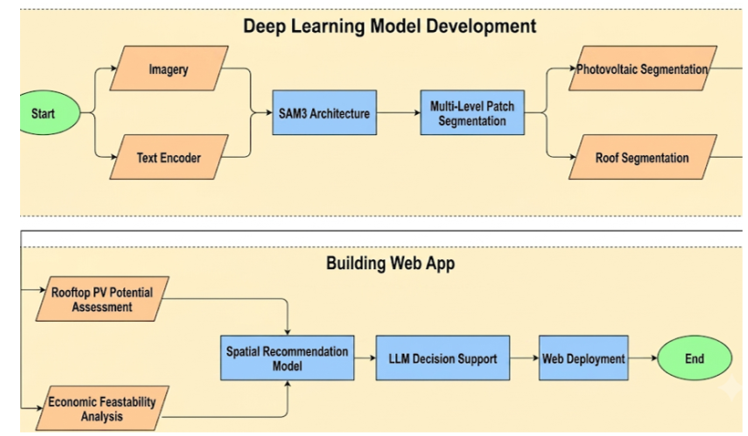
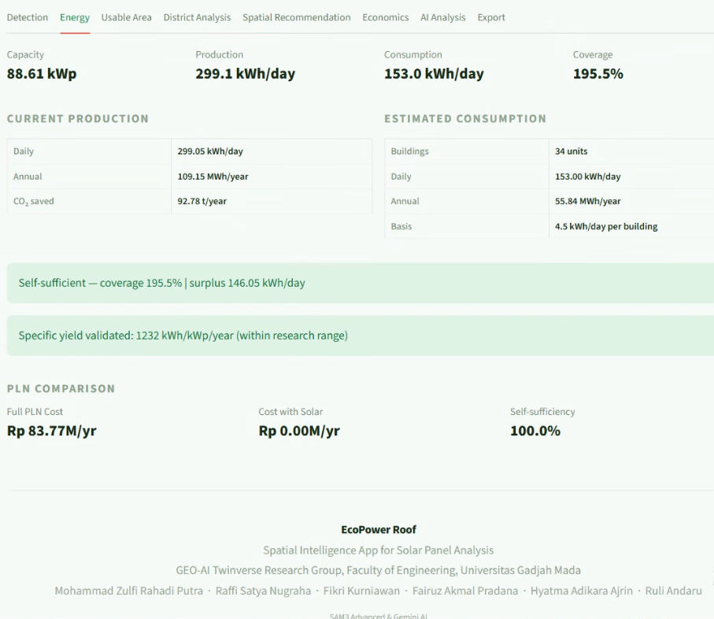
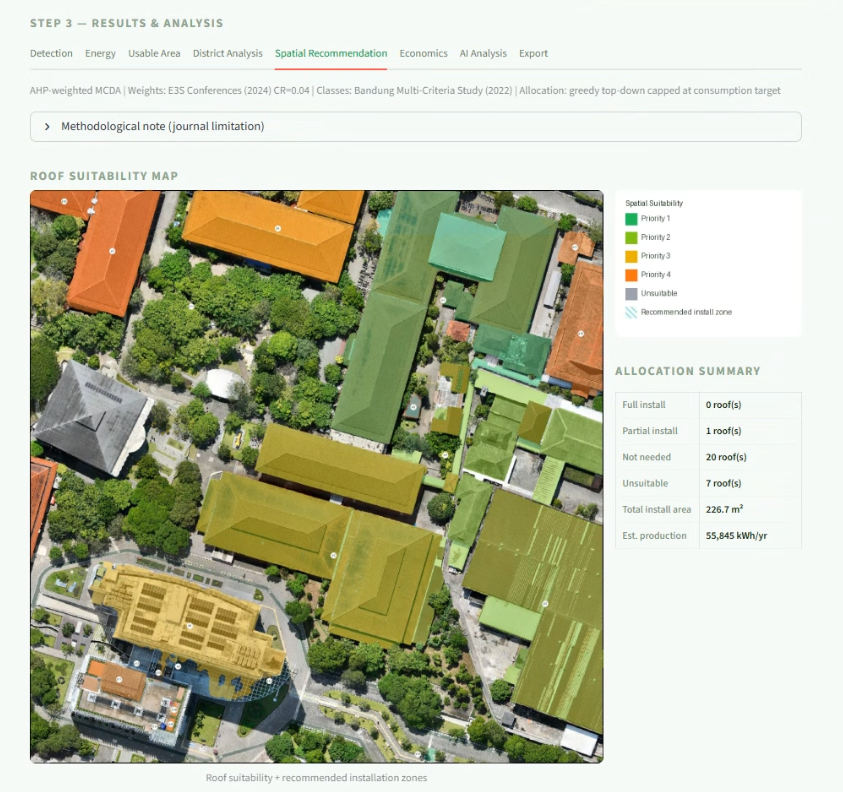
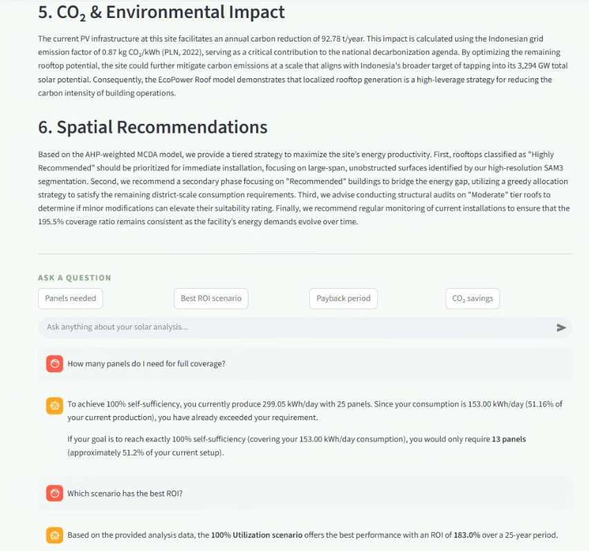

# EcoPower Roof

[](https://choosealicense.com/licenses/mit/)
[](https://www.python.org/)
[](https://streamlit.io/)
[](https://pytorch.org/)
[](https://openreview.net/pdf/c01d0dd8d4e7179b0952062eff08eb52c8d8c322.pdf)

> Built on [SAM3](https://github.com/facebookresearch/sam3) by Meta AI Research
> a unified, promptable segmentation model supporting language, exemplar, and visual
> prompts across images and videos (ICLR 2026).

**EcoPower Roof** is a scalable geospatial AI framework for urban rooftop solar potential
assessment. It integrates hierarchical deep learning segmentation via SAM3, techno-economic
modeling, AHP-weighted multi-criteria decision analysis (MCDA), and an LLM-assisted planning
dashboard — bridging the gap between complex geospatial outputs and actionable urban energy
policy for Indonesian municipalities.

For full setup, configuration, and deployment instructions, see [TECHNICAL.md](TECHNICAL.md).

---

## Table of Contents

- [Features](#features)
- [Framework Architecture](#framework-architecture)
- [How It Works](#how-it-works)
- [Dashboard Showcase](#dashboard-showcase)
- [Model Performance](#model-performance)
- [Case Study Results](#case-study-results)
- [Team](#team)
- [Acknowledgments](#acknowledgments)
- [License](#license)

---

## Features

### Hierarchical Rooftop Segmentation
- SAM3-based multi-scale patch inference for precise rooftop boundary detection
- Simultaneous identification of existing PV installations
- GeoTIFF support with automatic geospatial metadata extraction
- Adaptive processing across large-scale, medium-scale, and small-scale features

### Techno-Economic Modeling
- Reduction cascade pipeline: building type, setback, HVAC, structural, and tilt factors
- Automated usable area estimation per rooftop polygon
- Energy balance computation: annual yield, self-sufficiency ratio, and CO2 reduction
- Financial analysis: NPV, LCOE, ROI, and payback period projections

### Spatial Recommendation via MCDA
- AHP-weighted multi-criteria scoring across four utilization scenarios (25%, 50%, 75%, 100%)
- Five-tier prioritization output per site
- GIS-integrated spatial ranking for municipal planning workflows

### LLM-Assisted Planning Dashboard
- Gemini AI integration for natural language report synthesis
- Six-section structured planning narrative per assessed site
- Interactive chatbot interface for planners and energy agencies
- JSON export for downstream GIS or policy workflows

---

## Framework Architecture

```
EcoPower Roof
|
+-- 1. Patch Segmentation (SAM3 Backbone)
|   +-- Multi-level rooftop boundary detection
|   +-- PV installation mask identification
|   +-- GeoTIFF geospatial metadata extraction
|
+-- 2. Techno-Economic Modeling
|   +-- Reduction Cascade
|   |   +-- Building type factor
|   |   +-- Setback factor
|   |   +-- HVAC obstruction factor
|   |   +-- Structural capacity factor
|   |   +-- Panel tilt correction factor
|   +-- Usable area estimation
|   +-- Energy balance (kWh/yr, self-sufficiency %)
|   +-- Financial analysis (NPV / LCOE / ROI)
|   +-- CO2 reduction (t/yr @ 0.87 kg CO2/kWh)
|
+-- 3. Spatial Recommendation (AHP-MCDA)
|   +-- Utilization scenarios: 25% / 50% / 75% / 100%
|   +-- Prioritization tiers:
|       +-- Priority 1 : Highly Recommended
|       +-- Priority 2 : Recommended
|       +-- Priority 3 : Conditionally Viable
|       +-- Priority 4 : Low Priority
|       +-- Tier 5     : Not Recommended
|
+-- 4. LLM Planning Dashboard
    +-- Six-section structured site report
    +-- Interactive natural language Q&A
    +-- Actionable planning narrative output
```

---

## How It Works

The diagram below illustrates the end-to-end hierarchical pipeline — from raw aerial
imagery input through SAM3 patch segmentation, techno-economic modeling, AHP-MCDA
spatial prioritization, and finally LLM-assisted planning report generation.


*End-to-end hierarchical workflow: SAM3 segmentation → techno-economic modeling → AHP-MCDA prioritization → LLM planning output*

For a detailed technical walkthrough of each pipeline stage, including configuration,
deployment, and module-level documentation, refer to [TECHNICAL.md](TECHNICAL.md).

---

## Dashboard Showcase

### Rooftop Detection & PV Segmentation


*SAM3-based multi-scale rooftop boundary segmentation on aerial imagery*
*Existing solar panel identification with coverage area metrics*

---

### Energy & Economic Analysis


*Annual energy yield, self-sufficiency ratio, and financial projections*

---

### MCDA Spatial Prioritization Map


*AHP-weighted prioritization tiers across assessed rooftop sites*

---

### LLM Planning Report


*Gemini AI-generated six-section structured planning narrative*

---

## Model Performance

Validated across six sites in Yogyakarta, Jakarta, and Surabaya
without site-specific retraining:

| Metric | Roof Segmentation | PV Detection |
|---|---|---|
| IoU | 76.51% | 84.71% |
| Precision | 96.60% | 87.06% |
| Recall | 75.23% | 96.95% |
| F1-Score | 83.89% | 91.69% |
| Accuracy | 90.96% | 99.30% |

Rooftop segmentation achieves high precision on large heterogeneous surfaces,
while PV detection prioritizes high recall for smaller, visually distinct panel
areas — reflecting a complementary performance trade-off suited to the
dual-class inference task.

---

## Case Study Results

Assessed across **34 structures** covering **17,646.76 m2** with
**25 existing PV installations** identified:

| Metric | Value |
|---|---|
| Additional PV Potential | 2,580.56 kWp |
| Self-Sufficiency at PV Sites | > 195.5% |
| Return on Investment (ROI) | 183.0% |
| Annual CO2 Reduction | 92.78 t/yr |
| Emission Factor Applied | 0.87 kg CO2/kWh |

---

## Team

**GeoAI Twinverse Research Group**
Faculty of Engineering, Universitas Gadjah Mada
Yogyakarta, Indonesia

| Name | Role |
|---|---|
| Ruli Andaru | Researcher |
| Mohammad Zulfi Rahadi Putra | Researcher |
| Raffi Satya Nugraha | Researcher |
| Fairuz Akmal Pradana | Researcher |
| Hyatma Adikara Ajrin | Researcher |
| Fikri Kurniawan | Researcher |

---

## Acknowledgments

- **Meta AI Research** — [SAM3: Segment Anything Model 3](https://github.com/facebookresearch/sam3),
  a unified promptable segmentation model presented at ICLR 2026.
  EcoPower Roof is built directly on top of the SAM3 backbone for all
  rooftop and PV patch segmentation tasks.
- **Google** — Gemini AI API for LLM-assisted planning narrative generation
- **Streamlit** — Web application framework
- **World Bank Group & Solargis** — Global Solar Atlas 2.0 irradiance data
- **Universitas Gadjah Mada** — Institutional and academic support

> If you use EcoPower Roof in your research, please also cite the original SAM3 paper:
>
> ```bibtex
> @inproceedings{sam3_2026,
>   title     = {SAM 3: Segment Anything with Concepts},
>   author    = {Meta AI Research},
>   booktitle = {International Conference on Learning Representations (ICLR)},
>   year      = {2026},
>   url       = {https://github.com/facebookresearch/sam3}
> }
> ```

---

## License

This project is licensed under the **MIT License**.
See the [LICENSE](LICENSE) file for details.

---

<div align="center">

Developed by the GeoAI Twinverse Research Group
Faculty of Engineering, Universitas Gadjah Mada, Indonesia

</div>
